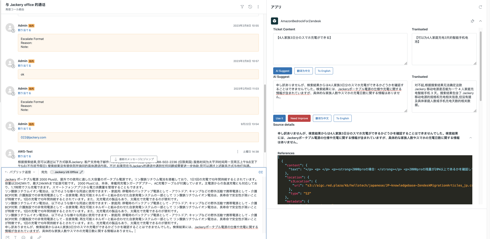
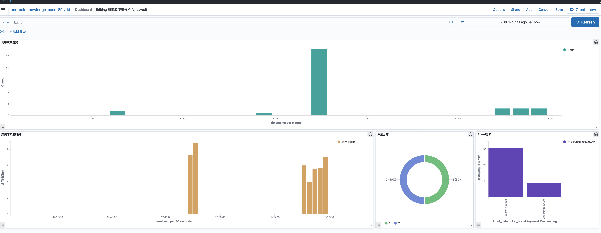

*Use of this software is subject to important terms and conditions as set forth in the License file*

# Zendesk ZDF app integrated with Amazon Bedrock



1. Download rlease from [Release](https://github.com/nimysan/amazon-bedrock-zendesk-app/releases/tag/1.0.0) and change the file metadata.json(to allow new backend url)

2. Install it zendesk as private app [Release](https://github.com/nimysan/amazon-bedrock-zendesk-app/releases/tag/1.0.0)

3. Set up the url and token also prompt if you need to customization.


> Call Statistics



## Description
This repo help to build auto ai suggest for ticket reply by Amazon Bedrock. [apps for Zendesk products](https://developer.zendesk.com/apps/docs/apps-v2/getting_started).

## How to integrate with Amazon Bedrock?

There is a [Github AIServer](https://github.com/nimysan/AIServer) to host Amazon Bedrock. 
This app will request urls host in that repo.

## Getting Started

[Garden Design](https://garden.zendesk.com/components/button)

### Dependencies
- [Node.js](https://nodejs.org/en/) >= 18.12.1
- [Ruby](https://www.ruby-lang.org/) = 2.6.x

### Setup
1. Clone or fork this repo
2. Run `yarn install`

To run your app locally in Zendesk, you need the latest [Zendesk CLI](https://github.com/zendesk/zcli).

### Running locally

To serve the app to your Zendesk instance with `?zcli_apps=true`, open a new terminal and run

```
yarn run watch
```
and then open a new terminal under `apps_scaffolds/packages/react` directory and run
```
zcli apps:server dist
```

## But why?
The App Scaffold includes many features to help you maintain and scale your app. Some of the features provided by the App Scaffold are listed below. However, you don't need prior experience in any of these to be able to use the scaffold successfully.

- [ES6 (ES2015)](https://babeljs.io/docs/learn-es2015/)

ECMAScript 6, also known as ECMAScript 2015, is the latest version of the ECMAScript standard. The App Scaffold includes the [Babel compiler](https://babeljs.io/) to transpile your code to ES5. This allows you to use ES6 features, such as classes, arrow functions and template strings even in browsers that haven't fully implemented these features.

- [Zendesk Garden](https://garden.zendesk.com/) React UI components

Collection of React components for Zendesk products. You’ll find components built to respond to a range of user input devices, tuned to handle right-to-left layouts, and finessed with just the right touch of subtle animation.

- [Webpack 5](https://webpack.github.io/) module bundler

Webpack is a module bundler, we use it to bundle up Javascript modules for use as web applications, also to perform tasks like transforming and transpiling, etc.

- [PostCSS](https://postcss.org//) stylesheets

PostCSS transforms stylesheets with JS plugins. These plugins can lint your CSS, support variables and mixins, transpile future CSS syntax, inline images, and more.

- [StandardJS](https://standardjs.com/) JS linting

StandardJS is a Javascript style guide, it helps catching style issues or code errors, and automatically formats code for you.

- [Jest](https://jestjs.io/) Javascript testing framework

Jest is bundled with JSDom and built on top of Jasmine. It's more than just a ReactJS testing framework. In the Zendesk Apps team, we use it for unit and integration testing of the Official Apps. It also includes a good test coverage toolset out of the box.

## Folder structure

The folder and file structure of the App Scaffold is as follows:

| Name                                    | Description                                                                                  |
|:----------------------------------------|:---------------------------------------------------------------------------------------------|
| [`.github/`](#.github)                  | The folder to store PULL_REQUEST_TEMPLATE.md, ISSUE_TEMPLATE.md and CONTRIBUTING.md, etc     |
| [`dist/`](#dist)                        | The folder in which webpack packages the built version of your app                           |
| [`spec/`](#spec)                        | The folder in which all of your test files live                                              |
| [`src/`](#src)                          | The folder in which all of your source JavaScript, CSS, templates and translation files live |
| [`webpack/`](#src)                      | translations-loader and translations-plugin to support i18n in the application               |
| [`.babelrc`](#packagejson)              | Configuration file for Babel.js                                                              |
| [`.browserslistrc`](#packagejson)       | Configuration file for browserslist                                                           |
| [`jest.config.js`](#packagejson)        | Configuration file for Jest                                                                  |
| [`package.json`](#packagejson)          | Configuration file for Project metadata, dependencies and build scripts                      |
| [`postcss.config.js`](#packagejson)     | Configuration file for PostCSS                                                               |
| [`webpack.config.js`](#webpackconfigjs) | Configuration file that webpack uses to build your app                                       |

#### dist
The dist directory is created when you run the app building scripts. You will need to package this folder when submitting your app to the Zendesk Apps Marketplace, It is also the folder you will have to serve when using [ZCLI](https://developer.zendesk.com/documentation/apps/app-developer-guide/zcli/). It includes your app's manifest.json file, an assets folder with all your compiled JavaScript and CSS as well as HTML and images.

#### spec
The spec directory is where all your tests and test helpers live. Tests are not required to submit/upload your app to Zendesk and your test files are not included in your app's package, however it is good practice to write tests to document functionality and prevent bugs.

#### src
The src directory is where your raw source code lives. The App Scaffold includes different directories for JavaScript, stylesheets, templates, images and translations. Most of your additions will be in here (and spec, of course!).

#### webpack
This directory contains custom tooling to process translations at build time:

- translations-loader.js is used by Webpack to convert .json translation files to JavaScript objects, for the app itself.
- translations-plugin.js is used to extract compulsory translation strings from the en.json file that are used to display metadata about your app on the Zendesk Apps Marketplace.


#### .babelrc
[.babelrc](https://babeljs.io/docs/en/babelrc.html) is the configuration file for babel compiler.

#### .browserslistrc
.browserslistrc is a configuration file to specify browsers supported by your application, some develop/build tools read info from this file if it exists in your project root. At present, our scaffolding doesn't reply on this file, [default browserslist query](https://github.com/browserslist/browserslist#queries) is used by [Babel](https://babeljs.io/docs/en/babel-preset-env/) and [PostCSS](https://github.com/csstools/postcss-preset-env#browsers)

#### jest.config.js
[jest.config.js](https://jestjs.io/docs/en/configuration.html) is the configuration file for Jest

#### package.json
package.json is the configuration file for [Yarn](https://yarnpkg.com/), which is a package manager for JavaScript. This file includes information about your project and its dependencies. For more information on how to configure this file, see [Yarn package.json](https://yarnpkg.com/en/docs/package-json).

#### postcss.config.js
postcss.config.js is the configuration file for [PostCSS](https://postcss.org/)

#### webpack.config.js
webpack.config.js is a configuration file for [webpack](https://webpack.github.io/). Webpack is a JavaScript module bundler. For more information about webpack and how to configure it, see [What is webpack](http://webpack.github.io/docs/what-is-webpack.html).

## Helpers
The App Scaffold provides some helper functions in `/src/javascripts/lib/helpers.js` to help building apps.

### I18n
The I18n (internationalization) module in `/src/javascripts/lib/i18n.js` provides a `t` method to look up translations based on a key. For more information, see [Using the I18n module](https://github.com/zendesk/app_scaffolds/blob/master/packages/react/doc/i18n.md).

## Parameters and Settings
If you need to test your app with a `parameters` section in `dist/manifest.json`, foreman might crash with a message like:

> Would have prompted for a value interactively, but zcli is not listening to keyboard input.

To resolve this problem, set default values for parameters or create a `settings.yml` file in the root directory of your app scaffold-based project, and populate it with your parameter names and test values. For example, using a parameters section like:

```json
{
  "parameters": [
    {
      "name": "myParameter"
    }
  ]
}
```

create a `settings.yml` containing:

```yaml
myParameter: 'some value!'
```

## Testing

The App Scaffold is currently setup for testing with [Jest](https://jestjs.io/). To run specs, open a new terminal and run

```
yarn test
```

Specs live under the `spec` directory.

## Deploying

To check that your app will pass the server-side validation check, run

```
zcli apps:validate dist
```

If validation is successful, you can upload the app into your Zendesk account by running

```
zcli apps:create dist
```

To update your app after it has been created in your account, run

```
zcli apps:update dist
```

Or, to create a zip archive for manual upload, run

```
zcli apps:package dist
```

taking note of the created filename.

For more information on the Zendesk CLI please see the [documentation](https://developer.zendesk.com/documentation/apps/app-developer-guide/zcli/).

## External Dependencies
External dependencies are defined in [webpack.config.js](https://github.com/zendesk/app_scaffolds/blob/master/packages/react/webpack.config.js). This ensures these dependencies are included in your app's `index.html`.

## Contribute
* Put up a PR into the master branch.
* CC and get a +1 from @zendesk/vegemite.

## Bugs
Submit Issues via [GitHub](https://github.com/zendesk/app_scaffolds/issues/new) or email support@zendesk.com.

## Useful Links
Links to maintaining team, confluence pages, Datadog dashboard, Kibana logs, etc
- https://developer.zendesk.com/
- https://github.com/zendesk/zendesk_apps_tools
- https://webpack.github.io
- https://developer.zendesk.com/documentation/apps/build-an-app/using-react-in-a-support-app/

## Copyright and license
Copyright 2018 Zendesk

Licensed under the Apache License, Version 2.0 (the "License"); you may not use this file except in compliance with the License.

You may obtain a copy of the License at
http://www.apache.org/licenses/LICENSE-2.0
Unless required by applicable law or agreed to in writing, software distributed under the License is distributed on an "AS IS" BASIS, WITHOUT WARRANTIES OR CONDITIONS OF ANY KIND, either express or implied. See the License for the specific language governing permissions and limitations under the License.
